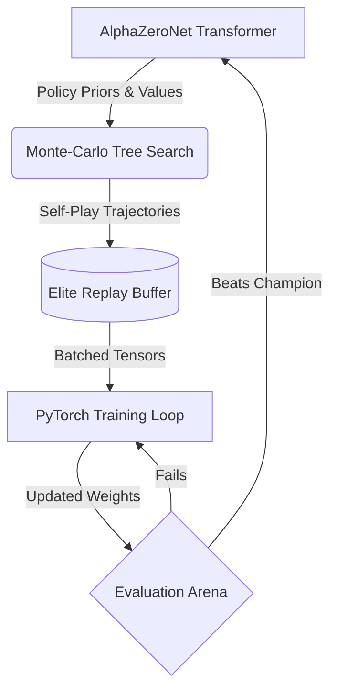

<div align="center">

# 🔺 Triango AI 🧠

**A High-Performance AlphaZero Reinforcement Learning Framework for Triango**

[](https://www.python.org/downloads/)
[](https://github.com/psf/black)
[](https://github.com/astral-sh/ruff)
[](https://mypy-lang.org/)
[](https://opensource.org/licenses/MIT)

*An elegant, modular, and deeply optimized AI ecosystem that teaches itself to master complex geometric puzzle environments through pure self-play.*

</div>

---

## 🚀 Quickstart: How to Run the AI

Triango AI is designed to be plug-and-play. It dynamically detects your strongest hardware (NVIDIA CUDA, Apple MPS, or Multi-Core CPUs) and seamlessly boots the training loop.

### 1. Requirements & Installation

> [!IMPORTANT]
> **Because Triango is engineered as a robust Python package, you MUST install it into your environment in editable mode to resolve module paths correctly.**

Ensure you have Python 3.10+ installed. Open your terminal at the project root and run:

```bash
# Install the core Triango AI package directly
pip install -e .
```

*(For developers contributing to Triango, install the test/lint suite via `pip install -e .[dev]`)*

### 2. Launching the Infinite AI Training Loop

Because you safely installed the package, you can now launch the Triango AlphaZero loop globally via Python's module runner:

```bash
python -m triango.main
```

> **🔥 What happens when you run this?**
> 1. **Asynchronous Self-Play**: Spawns highly-optimized worker processes to play thousands of MCTS-guided games against itself.
> 2. **Elite Memory**: Top 10% highest-scoring trajectories are permanently protected in an Elite Replay Buffer to prevent catastrophic forgetting.
> 3. **Transformer Training**: A PyTorch AdamW optimizer executes backpropagation on the Value head (MSE), Line Clear head (BCE), and Policy Distribution head (KL-Divergence).
> 4. **Arena Pits**: The newly tuned model plays simulated matches against the previous champion. If it wins, it overwrites the master `triango_model.pth`.
> 5. **Endless Mastery**: The cycle repeats indefinitely, continuously pushing the neural network towards geometric perfection.

---

## 🧠 The Architecture

Triango discards legacy CNNs in favor of a powerful **Transformer Encoder** architecture capable of capturing deep, long-range dependencies across the fragmented 96-tile triangular grid. 

Here is a high-level view of the self-play loop:



### 📂 Module Documentation Map

Every subsystem in this repository is heavily documented. If you want to understand how a component works, check its local `README.md`:

- 🗺️ **[Package Core (`src/triango`)](./src/triango/README.md)**: Hardware auto-detection and the main execution orchestrator loop.
- 📐 **[Game Mechanics (`src/triango/env`)](./src/triango/env/README.md)**: High-speed bitwise collision logic, grid state, and spatial triangle mappings.
- 🌳 **[Monte-Carlo Search (`src/triango/mcts`)](./src/triango/mcts/README.md)**: PUCT exploration nodes, batched sequential generation, and Dirichlet noise.
- 🤖 **[Neural Network (`src/triango/model`)](./src/triango/model/README.md)**: AlphaZeroNet Transformer layout and the 3 distinct Policy/Value/Line action heads.
- ⚙️ **[Execution Engine (`src/triango/training`)](./src/triango/training/README.md)**: Asynchronous multiprocessing pool generation and Elite memory boundaries.
- 🧪 **[Test Suites (`tests/`)](./tests/README.md)**: CI integration paths, Pytest assertions, and the interactive AI representation visualizer.

---

## 🛠️ Code Quality & CI Standards

We treat this repository with strict production-grade constraints to guarantee pristine stability:

* 🧹 **Formatting**: 100% compliant with `black`.
* ⚡ **Linting**: Aggressively checked by `ruff`.
* 🦺 **Rigid Typing**: Validated purely by `mypy` with 0 generic `Any` exceptions.
* 🛡️ **Coverage**: Functional test coverage mathematically proven at `> 80%` via `pytest-cov`.

To manually run the test verification suite and view the AI's internal visual representation logic, execute:
```bash
python -m pytest tests --cov=triango
```
